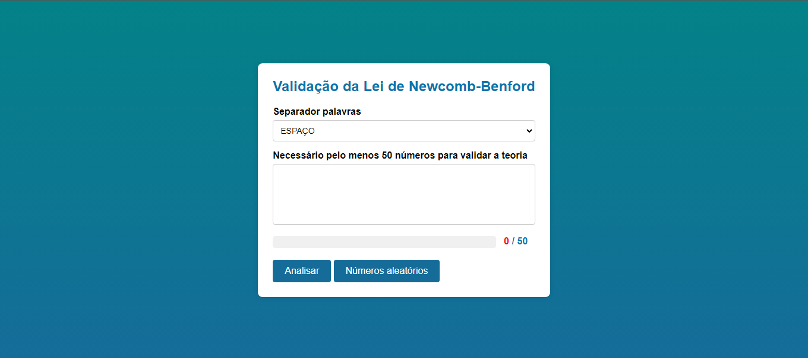
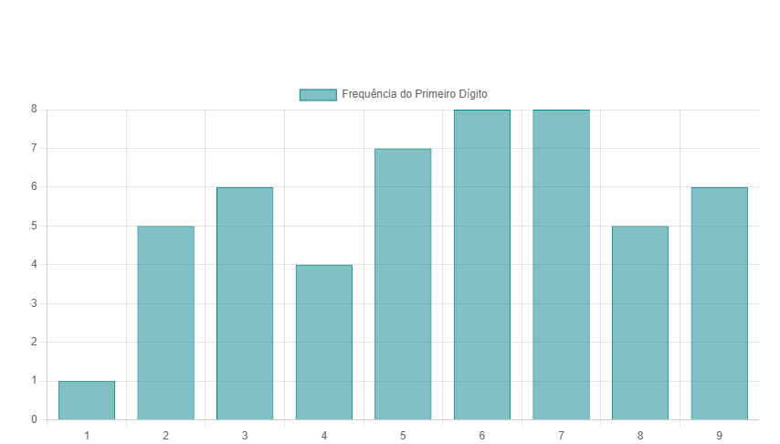

# Validação da Lei de Newcomb-Benford

## Sobre o Projeto

[**NewcombBenford**](https://michelleGomes85.github.io/TestingTheory-NewcombBenford/) é uma aplicação web que valida a Lei de Newcomb-Benford, também conhecida como Lei de Benford. A aplicação permite ao usuário inserir uma lista de números ou gerar números aleatórios para verificar se a distribuição dos dígitos iniciais segue o padrão esperado pela teoria.

## Teoria da Lei de Newcomb-Benford

A Lei de Newcomb-Benford, ou Lei do Primeiro Dígito, descreve a frequência de ocorrência dos dígitos iniciais em muitos conjuntos de dados do mundo real. Segundo a lei, o dígito inicial "1" ocorre com mais frequência que o "2", e assim por diante. A distribuição esperada é aproximadamente:

- **1:** 30.1%
- **2:** 17.6%
- **3:** 12.5%
- **4:** 9.7%
- **5:** 7.9%
- **6:** 6.7%
- **7:** 5.8%
- **8:** 5.1%
- **9:** 4.6%

## Funcionalidades

- **Selecionar Separador de Palavras**: Escolha entre espaço ou Enter como separador dos números.
- **Inserir Números**: Insira uma lista de números em uma área de texto.
- **Gerar Números Aleatórios**: Gere uma lista de números aleatórios.
- **Barra de Progresso**: Mostra a quantidade de números válidos inseridos.
- **Analisar Distribuição**: Verifica e exibe a distribuição dos primeiros dígitos dos números inseridos em um gráfico de barras.

## Botão "Gerar Números Aleatórios"

O botão **"Gerar Números Aleatórios"** permite gerar uma lista de números aleatórios. Este recurso demonstra como números aleatórios são gerados de forma objetiva e uniforme pelo computador, em contraste com escolhas subjetivas humanas.

## Tecnologias Utilizadas


## Estrutura do Projeto

- `index.html`: Estrutura HTML da página.
- `styles.css`: Estilos CSS da página.
- `javaScript.js`: Lógica JavaScript para manipulação dos dados e gráficos.

## Como Usar

1. Clone o repositório:
    ```sh
    git clone https://github.com/seu-usuario/TestingTheory-NewcombBenford.git
    ```

2. Navegue até o diretório do projeto:
    ```sh
    cd TestingTheory-NewcombBenford
    ```

3. Abra o arquivo `index.html` em um navegador web.

4. Selecione o separador de palavras, insira uma lista de números ou clique em **"Números Aleatórios"** para gerar uma lista automaticamente.

5. Clique em **"Analisar"** para verificar a distribuição dos primeiros dígitos e visualizar o gráfico.




## Licença / Autor

[](https://github.com/michelleGomes85/TestingTheory-NewcombBenford/blob/main/LICENSE) 
[](https://github.com/michellegomes85)
