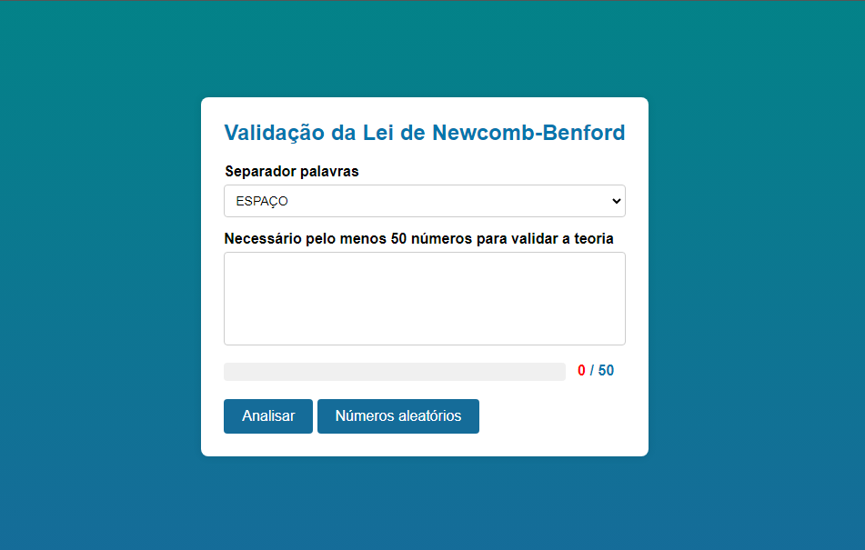

# Validação da Lei de Newcomb-Benford

Este projeto é uma aplicação web para validar a Lei de Newcomb-Benford, também conhecida como Lei de Benford. A aplicação permite ao usuário inserir uma lista de números ou gerar números aleatórios para verificar se a distribuição dos dígitos iniciais segue o padrão esperado pela teoria.

## Teoria da Lei de Newcomb-Benford

A Lei de Newcomb-Benford, ou Lei do Primeiro Dígito, é uma observação sobre a frequência de ocorrência dos dígitos em muitos conjuntos de dados do mundo real. De acordo com a lei, em muitos conjuntos de dados, o dígito inicial "1" ocorre com mais frequência que o "2", que ocorre mais frequentemente que o "3", e assim por diante, com o "9" ocorrendo com menos frequência. A distribuição esperada dos primeiros dígitos é aproximadamente a seguinte:

- 1: 30.1%
- 2: 17.6%
- 3: 12.5%
- 4: 9.7%
- 5: 7.9%
- 6: 6.7%
- 7: 5.8%
- 8: 5.1%
- 9: 4.6%

## Funcionalidades

- **Selecionar Separador de Palavras**: O usuário pode escolher entre espaço ou Enter como separador dos números.
- **Inserir Números**: O usuário pode inserir uma lista de números em uma área de texto.
- **Gerar Números Aleatórios**: O usuário pode gerar uma lista de números aleatórios.
- **Barra de Progresso**: Exibe a quantidade de números válidos inseridos.
- **Analisar Distribuição**: Verifica e exibe a distribuição dos primeiros dígitos dos números inseridos em um gráfico de barras.

## Botão "Gerar Números Aleatórios"

O botão "Gerar Números Aleatórios" permite ao usuário gerar uma lista de números aleatórios. Este recurso é importante para demonstrar como o computador gera números aleatórios de forma diferente dos humanos. Enquanto humanos tendem a escolher números que parecem "mais aleatórios" de uma forma subjetiva e tendenciosa, os números gerados pelo computador seguem um algoritmo que garante uma distribuição mais uniforme e objetiva, o que ajuda a demonstrar a aplicabilidade da Lei de Newcomb-Benford.

## Tecnologias Utilizadas

- HTML5
- CSS3
- JavaScript
- [Chart.js](https://www.chartjs.org/) para a geração do gráfico

## Estrutura do Projeto

- `index.html`: Contém a estrutura HTML da página.
- `styles.css`: Contém os estilos CSS da página.
- `javaScript.js`: Contém a lógica JavaScript para manipulação dos dados e geração do gráfico.

## Como Usar

1. Clone o repositório:
    ```sh
    git clone https://github.com/seu-usuario/TestingTheory-NewcombBenford.git
    ```

2. Navegue até o diretório do projeto:
    ```sh
    cd TestingTheory-NewcombBenford
    ```

3. Abra o arquivo `index.html` em um navegador web.

4. Selecione o separador de palavras, insira uma lista de números ou clique em "Números aleatórios" para gerar uma lista automaticamente.

5. Clique em "Analisar" para verificar a distribuição dos primeiros dígitos e visualizar o gráfico.

## Capturas de Tela




## Licença / Autor

[](https://github.com/michelleGomes85/TestingTheory-NewcombBenford/blob/main/LICENSE) 
[](https://github.com/michellegomes85)
